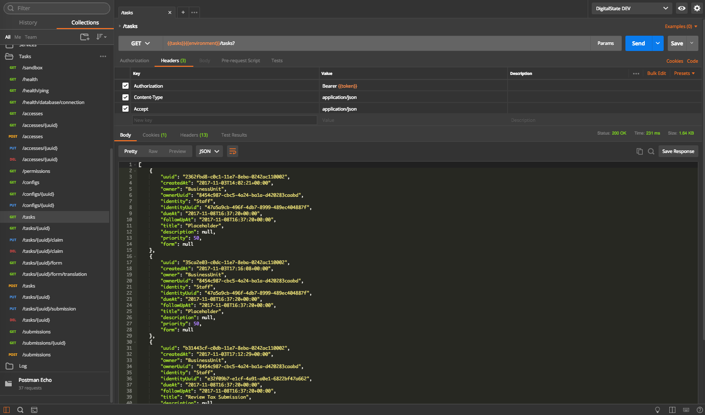

# Tasks

** The Tasks microservice is a enterprise only feature.**

The Tasks microservice provides mappings and functionality for User Tasks, primarily managed by the Workflow/Camunda microserivce.

Tasks allow forms (such as those from the Formio microservice) to be loaded and presented to the user through the API, Admin UI and Portal UI.

# Use Cases

1. Staff review of citizen submissions/service requests.
1. Delayed payments.
1. Additional requests from government to individuals/citizens.
1. Third-party interactions that occur after initial service request submission. (Citizen starts a request, but it requires the review and approval from another citizen before it is sent to staff for processing).
1. ...

# Screenshots

...

## Postman

## Portal

---

## Admin

---

---

---

---

---

---

# Data Flow

1. Task is created in camunda with a Assignee (Individual or Staff) and a Candidate Group (Business Unit)
1. Tasks microservice queries Camunda for user tasks.  Candidate Group (Business Unit) is used for permissions management.
1. Tasks microservice manages actions between user and Camunda.
1. Form schema is returned based on `formkey` of the user task.
1. Form is validated against form validation serve (typically Formio microservice).
1. On successful validation data is put into a Task Submission.  Task Submission is then passed into Camunda User Task as part of the Task completion endpoint in Camunda.

The Task Submissions Entity/data is used as a generic data store that stores all task submissions so that Task Drafts can be managed as well as submitting data to other systems other than Camunda.